# Huawei Cloud Execution Blueprint

## Intent

This blueprint turns the local SAT Agentic package into an operator-ready Huawei Cloud execution plan. The local system still acts as the development front end: prompts, agents, artifact generation, reviews, local tests, release manifests, and pre-execution gates. Huawei Cloud remains the execution layer.

The boundary is strict:

- Local agent generates and validates artifacts.
- Local release package is reviewed and frozen.
- Cloud operator binds real Huawei Cloud resources.
- Real DataArts, MRS, DWS, OBS, IAM, and KMS actions require a separate approval.

## Source Package

For a run such as `front-11ed357b8f`, the cloud handoff reads:

- `generated/<run_id>/release/release_manifest.json`
- `generated/<run_id>/release/dataarts_import_package.json`
- `generated/<run_id>/release/resolved_dataarts_import_package.json`
- `generated/<run_id>/release/deployment_preflight.json`
- `generated/<run_id>/release/cloud_parameter_map.json`
- `generated/<run_id>/release/final_import_manifest.json`
- `generated/<run_id>/pre_execution/pre_execution_readiness.json`
- `generated/<run_id>/pre_execution/pre_execution_report.md`

## Target Huawei Cloud Services

| Layer | Huawei Cloud service | Purpose |
| --- | --- | --- |
| Storage | OBS | Raw, silver, gold, release, and audit object layers |
| Batch compute | MRS Spark | Execute reviewed PySpark transformation artifacts |
| Orchestration | DataArts Factory | Import reviewed DAG package, keep schedules disabled until approval |
| Serving | GaussDB(DWS) | Load gold aggregates and expose BI/query tables |
| Security | IAM, KMS/DEW | Least privilege, encryption key binding, audit boundary |
| Observability | Cloud Eye, AOM, DataArts logs | Job status, row counts, bytes, duration, and failure evidence |

## Data Flow

1. Local agent package is validated and frozen.
2. Operator uploads the frozen release bundle to `obs://<bucket>/release/<run_id>/`.
3. DataArts import package is reviewed in the approved workspace with schedules disabled.
4. DataArts points reviewed Spark steps to MRS Spark.
5. MRS reads raw/silver inputs from OBS and writes reviewed outputs to OBS silver/gold.
6. DWS loads aggregate serving tables from OBS gold.
7. Audit files, manifests, row-count checks, and lineage evidence are written to OBS audit.

```mermaid
flowchart LR
    Prompt["Business prompt"] --> Agents["Local MaaS + LangGraph agents"]
    Agents --> Release["Frozen local release package"]
    Release --> PreExec["4 pre-execution gates"]
    PreExec --> OBSRelease["OBS release/audit paths"]
    OBSRelease --> DataArts["DataArts Factory import"]
    DataArts --> MRS["MRS Spark job"]
    MRS --> OBSSilverGold["OBS silver/gold"]
    OBSSilverGold --> DWS["GaussDB(DWS) serving"]
    DWS --> BI["BI / ChatBI / validation queries"]
```

## Default Region and Resource Posture

- Default region: `la-south-2`.
- POC posture: pay-per-use, minimal sizes, private subnet first.
- Public ingress: avoid by default; expose only BI or API endpoints through explicit HTTPS ingress if required.
- Resource creation: not included in this package. Operators must bind approved existing resources or create them through a separate reviewed IaC change.

## Business Processing Principles

- Business contract is the source of truth. Code must not exceed the approved contract.
- Direct identifiers such as RFC must not leave the local synthetic/raw handling boundary unless explicitly approved.
- Gold and DWS outputs expose aggregate or masked/hash identifiers only.
- Production execution is blocked until PySpark, SQL, and DAG artifacts are approved.
- Every cloud step must produce evidence: input URI, output URI, row counts, failed records, runtime, operator, and artifact hash.
- Rollback must be possible by disabling schedules, preserving the prior DWS serving schema, and keeping release artifacts immutable.

## Live Cloud Confirmation Checklist

Before execution, an operator must confirm:

- Service availability and quota in the chosen region.
- OBS bucket, KMS encryption, lifecycle, and path ownership.
- VPC, private subnet, security groups, and network reachability.
- MRS cluster id and Spark runtime compatibility.
- DataArts workspace id, import permissions, and disabled schedule status.
- DWS connection name, schema, and load permissions.
- IAM roles for DataArts, MRS, OBS, DWS, and audit readback.
- Current pay-per-use prices and approved execution window.
