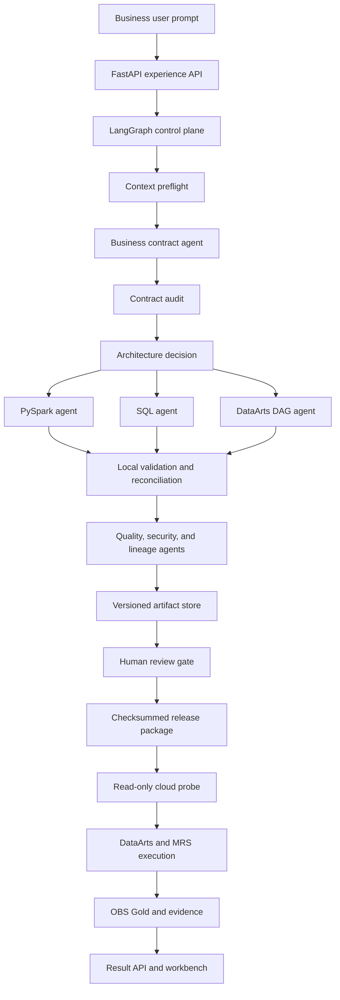

# Reference Architecture

## Architectural Position

Use the Agentic Data Workbench to replace or augment the Notebook as the development entry point. Keep data storage, distributed compute, scheduling, warehouse serving, identity, and operations on governed Huawei Cloud services.

The architectural claim is therefore:

> Replace notebook-centric authoring with contract-centric agent collaboration; retain controlled cloud execution.

This boundary avoids turning the LLM into a scheduler, data engine, or source of production truth.

## Five Planes

### 1. Experience Plane

Provide a chat-first web application that accepts business intent and progressively reveals operational detail. Use FastAPI to serve the application and APIs. Keep code-server optional for engineers who need file-level intervention.

### 2. Agent Control Plane

Use LangGraph to manage explicit states, branches, retries, and evidence. Connect Huawei MaaS through an OpenAI-compatible adapter when configured. Preserve a deterministic local path for offline development and controlled fallback.

Recommended agent roles:

| Agent | Responsibility | Primary output |
|---|---|---|
| Context Agent | Inspect schema, samples, policies, and available services | `data_context.json` |
| Contract Agent | Convert intent into testable business semantics | `business_contract.yaml` |
| Architecture Agent | Select layers, engines, and orchestration boundaries | `architecture_decision.json` |
| PySpark Agent | Generate MRS Spark transformations | `mrs_transform.py` |
| SQL Agent | Generate serving and reconciliation SQL | `dws_serving.sql` |
| Orchestration Agent | Generate DataArts-compatible workflow definitions | `dataarts_dag.yaml` |
| Quality Agent | Define and execute data-quality gates | `quality_gates.json` |
| Security Agent | Check identifiers, access, logging, and release policy | `security_review.md` |
| Lineage Agent | Record source-to-output field and job relationships | `lineage_manifest.json` |

### 3. Governance Plane

Treat the business contract, artifact reviews, quality gates, privacy policy, checksums, and release state as first-class data. Keep governance independent from model prose so it can be validated deterministically.

### 4. Execution Plane

Use managed services for real work:

- OBS for landing, raw, refined, Gold, release, and evidence objects.
- MRS Spark for distributed transformations.
- DataArts Factory for governed orchestration and scheduling.
- DWS when warehouse-style serving, concurrency, or BI semantics are required.
- IAM, VPC, security groups, KMS/DEW, Cloud Eye, and LTS for security and operations.

### 5. Evidence Plane

Store run manifests, model-path metadata, approvals, checksums, cloud job identifiers, row counts, quality outcomes, and lineage. Expose a small result API and a detailed workbench view over this evidence.

## Component Flow

## Runtime States

Model the backend workflow independently from the visible page:

| State | Meaning | Allowed next states |
|---|---|---|
| `composing` | User is entering or refining intent | `queued` |
| `queued` | Run record exists and inputs are frozen | `running`, `cancelled` |
| `running` | Agents or validators are processing | `review_required`, `failed` |
| `review_required` | Required artifacts await decisions | `released`, `rejected` |
| `released` | Immutable execution package exists | `executing`, `expired` |
| `executing` | Cloud services accepted the package | `completed`, `failed` |
| `completed` | Results and evidence passed acceptance | terminal |
| `failed` | A stage failed with retryable/non-retryable evidence | `queued`, terminal |

Map these states to three interface modes:

- `compose`: `composing`
- `progress`: `queued`, `running`, `executing`
- `results`: `review_required`, `released`, `completed`, `failed`

## Data Boundaries

Keep four kinds of information separate:

1. Business intent: user language, goals, metrics, scope, and acceptance.
2. Model context: compact schema, allowed fields, samples with masked values, and policy summaries.
3. Execution data: source and output objects processed only by approved services.
4. Evidence: metadata and aggregated outcomes safe for the workbench.

Do not place raw direct identifiers in model context, logs, browser responses, or generated artifacts. Prefer field names, types, distributions, hashed examples, and policy labels.

## Deployment Topologies

### Local Validation

Run FastAPI, LangGraph, local synthetic files, deterministic artifact generation, and optional MaaS. Mock cloud bindings and keep execution disabled.

### Cloud POC

Host the web service on a restricted ECS instance, store releases/evidence in OBS, execute Spark jobs on MRS, and optionally import DAGs into DataArts. Keep security-group ingress narrow and separate MaaS credentials from the code package.

### Production Pilot

Place the service behind enterprise ingress, use federated identity and secrets management, enable centralized logs/metrics, isolate execution roles, apply lifecycle/cost controls, and require a change-management approval before release execution.

## Decision Rules

- Choose MRS Spark for large transformations, shuffles, file compaction, and lakehouse processing.
- Choose DWS for highly concurrent analytical SQL, governed marts, and BI serving.
- Choose DataArts when the workflow needs scheduling, dependency management, retries, and operator visibility.
- Keep a simple FastAPI scheduler only for local demonstrations; do not present it as production orchestration.
- Prefer object-based release packages over direct model-to-cloud submission.
- Keep generated artifacts portable and inspectable even when the user never opens an IDE.
