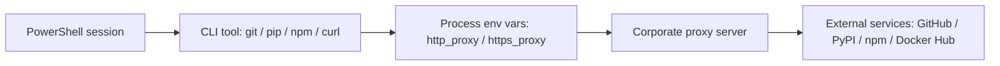

# Hardened Corporate Proxy Setup for PowerShell

Security-first proxy toggles for Windows Terminal and PowerShell.

This folder replaces the earlier copy/paste profile snippet with a small
PowerShell module. The module keeps proxy credentials out of your profile file,
does not change global Git or Docker settings, and never recommends disabling
TLS verification.

## What this does

When a terminal tool such as `git`, `pip`, `npm`, `curl`, or `winget` needs to
reach the internet through a corporate proxy, it usually reads process
environment variables such as `http_proxy` and `https_proxy`.

This module provides three commands:

| Command | Purpose |
| --- | --- |
| `Set-CorporateProxy` | Enables proxy variables for the current PowerShell process |
| `Clear-CorporateProxy` | Restores or removes proxy variables |
| `Get-CorporateProxyStatus` | Shows which proxy variables are currently set, with credentials masked |

Convenience aliases are exported too:

| Alias | Command |
| --- | --- |
| `open_proxy` | `Set-CorporateProxy` |
| `close_proxy` | `Clear-CorporateProxy` |
| `proxy_status` | `Get-CorporateProxyStatus` |

## Network path



## Quick start

From this directory:

```powershell
Import-Module .\SafeCorporateProxy.psm1 -Force

Set-CorporateProxy -HostName "proxy.example.com" -Port 8080
Get-CorporateProxyStatus
Clear-CorporateProxy
```

`Set-CorporateProxy` prompts for credentials at runtime by default. The password
is not written to your PowerShell profile, repository, or Git configuration.

If your proxy does not require authentication:

```powershell
Set-CorporateProxy -HostName "proxy.example.com" -Port 8080 -NoCredential
```

If a specific tool needs uppercase variables:

```powershell
Set-CorporateProxy -HostName "proxy.example.com" -Port 8080 -IncludeUppercase
```

On Windows, environment variable lookup is case-insensitive, so uppercase and
lowercase names resolve to the same process environment entry. On Linux/macOS,
`-IncludeUppercase` creates separate uppercase entries.

If you need to bypass internal addresses:

```powershell
Set-CorporateProxy `
  -HostName "proxy.example.com" `
  -Port 8080 `
  -NoProxy "localhost","127.0.0.1","::1",".corp.example.com","10.0.0.0/8"
```

## Optional profile snippet

Keep credentials out of your profile. Only import the module:

```powershell
Import-Module "C:\path\to\proxy-setup\SafeCorporateProxy.psm1" -Force
```

After opening a new terminal:

```powershell
open_proxy -HostName "proxy.example.com" -Port 8080
close_proxy
```

## Safety decisions

This version deliberately avoids several risky shortcuts:

- No plaintext password in a profile file.
- No global `git config --global http.proxy` with credentials.
- No `git config --global http.sslVerify false`.
- No persistent machine or user environment variable writes.
- No Docker configuration rewrites.
- No credential echoing in status output.
- No silent proxy host strings; host and port are validated.
- No empty-string cleanup; variables are restored or removed.

## Limitations

Environment variables are still visible to child processes started from the same
terminal. That is how proxy-aware CLI tools consume them. Avoid running
untrusted commands in a session where proxy credentials are active.

Some tools require their own proxy configuration. Docker Desktop, WSL, browser
applications, and already-running processes may not inherit variables from this
PowerShell session.

Corporate TLS interception should be handled by installing the corporate root CA
through an approved channel. Do not disable TLS verification as a workaround.

## Troubleshooting

Show active values with masking:

```powershell
Get-CorporateProxyStatus
```

Verify only the current process environment:

```powershell
Get-ChildItem Env:*proxy*
```

Clear the session:

```powershell
Clear-CorporateProxy
```

If Git still does not use the proxy, inspect its config without adding secrets:

```powershell
git config --global --get-regexp "http\..*proxy"
git config --system --get-regexp "http\..*proxy"
```

Remove stale global proxy entries if needed:

```powershell
git config --global --unset http.proxy
git config --global --unset https.proxy
```
